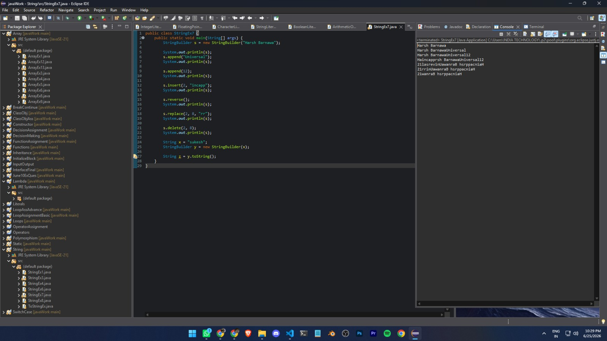

# ☕ Java Workshop

> A comprehensive repository documenting my Java learning journey from core fundamentals to Object-Oriented Programming through hands-on coding, assignments, practice programs, and problem-solving.

---

## 📖 About

This repository contains all the Java programs, assignments, and practice exercises completed during my Java learning journey. It is organized topic-wise, making it easy to understand the progression from basic concepts to advanced Object-Oriented Programming.

The primary goal of this repository is to build strong Java fundamentals before moving towards advanced Java development using Collections, Exception Handling, File Handling, JDBC, Multithreading, and Spring Boot.

---

# 🚀 Topics Covered

## 📌 Java Fundamentals

- Introduction to Java
- History of Java
- Features of Java
- JDK, JRE & JVM
- Java Program Structure
- Compilation & Execution Process
- Tokens
- Keywords
- Identifiers
- Variables
- Data Types
- Literals
- Type Casting

---

## ⌨️ Input / Output

- Scanner Class
- Buffered Input
- Console Output
- Formatted Output

---

## ➕ Operators

- Arithmetic Operators
- Unary Operators
- Relational Operators
- Logical Operators
- Bitwise Operators
- Assignment Operators
- Conditional (Ternary) Operator
- Increment & Decrement Operators

---

## 🔀 Decision Making

- if
- if-else
- else-if Ladder
- Nested if
- Switch Case
- Enhanced Switch

---

## 🔁 Loops

- for Loop
- while Loop
- do-while Loop
- Nested Loops

---

## ⏹️ Loop Control Statements

- break
- continue

---

## ⚙️ Methods / Functions

- Method Declaration
- Method Calling
- Parameters
- Arguments
- Return Type
- Method Overloading
- Recursive Functions

---

# 📦 Object-Oriented Programming (OOP)

## 🏗️ Classes & Objects

- Class Creation
- Object Creation
- Constructors
- Object Initialization

### Constructors

- Default Constructor
- Parameterized Constructor
- Constructor Overloading
- Copy Constructor Concept

### Static Keyword

- Static Variables
- Static Methods
- Static Blocks

### Initialization Blocks

- Instance Initialization Block
- Static Initialization Block

---

## 🧬 Inheritance

- Single Inheritance
- Multilevel Inheritance
- Hierarchical Inheritance
- Constructor Chaining
- super Keyword

---

## 🎭 Polymorphism

- Method Overloading
- Method Overriding
- Runtime Polymorphism
- Dynamic Method Dispatch

---

## 📄 Interface & Final

### Interface

- Interface Basics
- Multiple Inheritance using Interface
- Default Methods
- Static Methods

### Final Keyword

- Final Variable
- Final Method
- Final Class

---

## 🧠 Lambda Expressions

- Functional Interfaces
- Lambda Syntax
- Lambda Expressions Examples

---

# 📚 Arrays

- One Dimensional Array
- Two Dimensional Array
- Array Traversal
- Searching
- Basic Array Problems

---

# 🔤 Strings

- String Class
- String Methods
- String Comparison
- StringBuilder
- StringBuffer
- Character Manipulation

---

# 💻 Practice Programs

## Decision Making

- Greatest of Three Numbers
- Positive / Negative
- Even / Odd
- Leap Year
- Vowel / Consonant
- Uppercase / Lowercase
- Calculator
- Switch Based Programs

---

## Loop Programs

- Factorial
- Fibonacci Series
- Tribonacci Series
- Prime Numbers
- Armstrong Number
- Palindrome Number
- Reverse Number
- Sum of Digits
- Product of Digits
- Count Digits
- GCD
- LCM
- Factors
- Perfect Number
- Strong Number
- Harmonic Series
- AP Series
- GP Series

---

## Pattern Programs

- Star Patterns
- Number Patterns
- Floyd's Triangle
- Pascal's Triangle

---

## Function Programs

- Prime Check
- Armstrong Check
- Palindrome Check
- Reverse Number
- Count Digits
- Recursive Factorial
- Recursive Fibonacci
- Recursive Sum
- Recursive String Reverse
- Recursive Palindrome

---

# 📂 Repository Structure

```text
Java-Workshop/
│
├── Array/
├── BreakContinue/
├── ClassObj/
├── ClassObjAss/
├── Constructor/
├── DecisionAssignment/
├── DecisionMaking/
├── FunctionAssignment/
├── Functions/
├── Inheritance/
├── InitializeBlock/
├── InputOutput/
├── InterfaceFinal/
├── June10ExQues/
├── Lambda/
├── Literals/
├── LoopAssAdvance/
├── LoopAssignmentBasic/
├── Loops/
├── OperatorAssignment/
├── Operators/
├── Polymorphism/
├── Static/
├── String/
├── SwitchCase/
│
├── readme-assets/
│   └── workspaceSS.png
│
└── README.md
```

---

# 🛠️ Technologies Used

- Java
- Eclipse IDE
- Git
- GitHub

---

# 📸 Workspace

> Repository workspace in Eclipse IDE

<p align="center">
  
</p>

---

# 🎯 Learning Roadmap

### ✅ Completed

- Java Fundamentals
- Input / Output
- Operators
- Decision Making
- Loops
- Methods
- Arrays
- Strings
- Constructors
- Static
- Initialization Blocks
- Classes & Objects
- Inheritance
- Polymorphism
- Interfaces
- Lambda Expressions

### 🚀 Next Topics

- Exception Handling
- Collections Framework
- File Handling
- Multithreading
- Generics
- Wrapper Classes
- Java I/O
- JDBC
- Stream API
- Java 8 Features
- Networking
- Spring Boot

---


