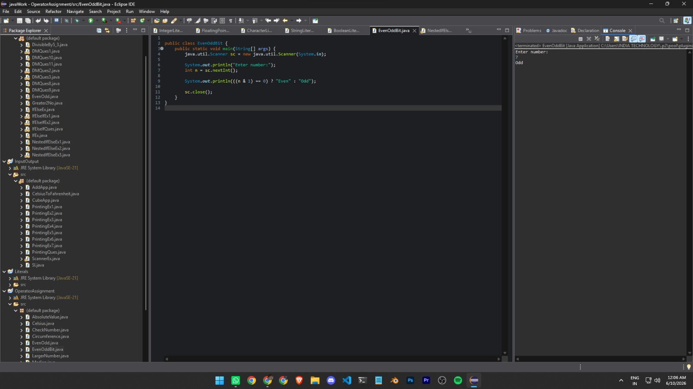

# Java Workshop

Learning Java from scratch and building a strong foundation by practicing concepts through small programs and assignments.

## What I've Covered So Far

* Java Basics
* JDK, JRE & JVM
* Tokens & Keywords
* Variables & Data Types
* Literals
* Input / Output
* Operators

  * Arithmetic Operators
  * Relational Operators
  * Logical Operators
  * Bitwise Operators
  * Conditional Operator
  * Increment & Decrement Operators
  * Type Casting
* Decision Making

  * if
  * if-else
  * nested if-else

## Projects / Assignments

* Literals
* InputOutput
* Operators
* OperatorAssignment
* DecisionMaking

## Development Setup

* Java
* Eclipse IDE

## Note

This repository contains my Java learning journey and workshop assignments. The goal is not just to complete programs, but to understand how Java works under the hood and build strong programming fundamentals before moving to advanced topics.
